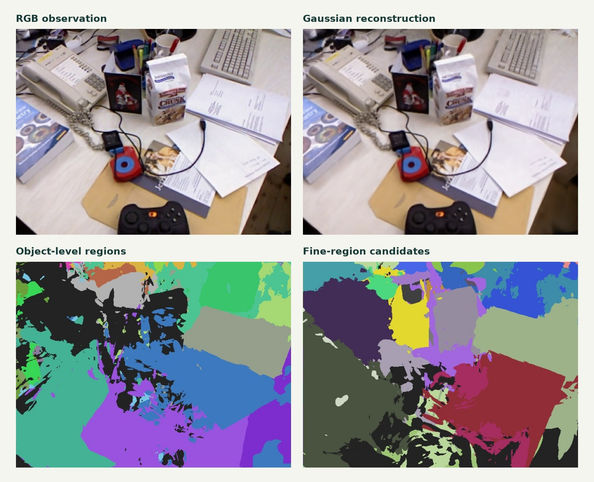
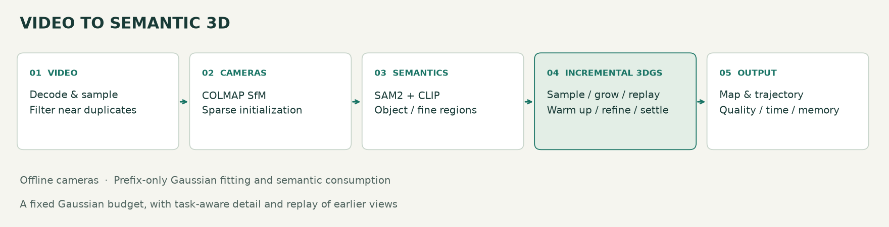
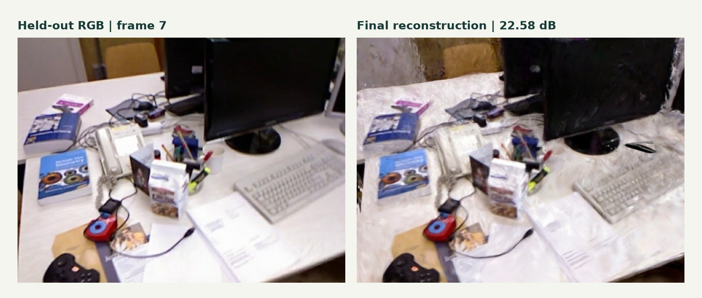

# 语义驱动的增量式三维高斯重建

[English](README.en.md)

**从一段室内 RGB 视频，构建可持续更新、具有物品语义的三维场景。**

`3D Gaussian Splatting` · `SAM2` · `CLIP` · `COLMAP` · `PyTorch / CUDA` · `WebGL2`



*真实 TUM desk 场景的最终阶段训练视角。语义颜色表示预测区域 ID，细区域为候选层级。*

## 项目介绍

本项目打通 **视频解码 → 相机估计 → 语义分割 → 增量 Gaussian 优化 → 地图导出与可视化**。输入普通室内视频，无需用户提供深度图、相机位姿或手工分割标注。

核心设计是让语义参与重建过程：根据重要物品、细区域和边界，决定**训练哪些图像、在哪里增加高斯、如何分配有限容量，以及回看哪些旧视角**。地图同时保存外观与语义，支持物品查看和层级区域展示。

## 核心功能

| 功能 | 实现与价值 |
|---|---|
| 视频直接输入 | 支持 MP4、MOV、MKV、AVI 等可解码视频，自动抽帧、过滤近重复帧，估计相机和稀疏结构。 |
| 两级语义关联 | 将 SAM2 区域、CLIP 描述和三维重叠结合，跨视角维护物品级与细区域级 ID。 |
| 自定义重要物品 | 用英文物品词指定关注目标，例如显示器、键盘、杯子，将匹配结果转化为重建优先级。 |
| 有预算的增量更新 | 保留已有地图，随图像批次扩展；阶段容量逐步释放，最终默认上限为 **500,000** 个高斯。 |
| 稳定增密 | 新高斯满足年龄、多视角梯度支持和冷却条件后才能再次增密；批次末尾固定拓扑继续拟合。 |
| 完整输出与回放 | 导出 PLY、完整模型、语义、相机轨迹和逐阶段地图；回放同步展示视频、地图与计算开销。 |

## 设计亮点

### 1. 语义决定计算花在哪里

三项语义控制贯穿训练，而不只是训练后给地图上色。

| 模块 | 如何工作 | 目标 |
|---|---|---|
| **S：语义采样** | 综合 RGB 误差、语义新颖性和任务重要性选择视角与裁剪区域，同时保留均匀探索。 | 将优化时间分给有信息的观测。 |
| **B：容量分配** | 根据屏幕梯度，提高重要物品和可靠边界的增密优先级；谨慎裁剪有证据的低贡献背景，并保护空间代表点。 | 在有限容量内兼顾重点细节和场景覆盖。 |
| **R：语义回放** | 根据区域覆盖、重要性与视角差异选择旧图，保留时间覆盖；稳定阶段均衡回看已到达训练视角。 | 降低学习新区域时对旧区域的遗忘。 |

### 2. 在重建过程中学习语义

每个高斯携带 **16 维压缩 CLIP 特征**、两级 ID、置信度、重要性和边界属性；物品节点保留有界的多视角 CLIP 描述。特征监督更新语义属性，RGB 拟合与语义控制器更新几何和外观。新增高斯继承语义，语义属性随拓扑操作一起维护。

### 3. 给分裂后的高斯足够拟合时间

每批默认 **2,400 次更新 = 200 步预热 + 1,400 步拟合与拓扑调整 + 800 步稳定拟合**。新高斯需要满足成熟条件，父高斯也有再次增密冷却；尾部停止增密与裁剪，继续用已到达图像拟合。容量是上限，只有满足条件才增密。

上述为本项目实现的设计与工程贡献，基于现有开源方法构建。

## 增量重建原理



1. **初始化**：COLMAP 从视频估计相机和稀疏点，初始化点按观测到达顺序释放。
2. **加入新批次**：沿用已有高斯参数，用当前已到达的训练图像与语义教师更新控制信息。
3. **选择与拟合**：混合新图与旧图回放，渲染当前地图，与真实 RGB 比较并反向传播。
4. **增密与裁剪**：依据梯度、重要性、边界可靠性和成熟条件分裂或复制高斯；背景满足证据门槛时才裁剪。
5. **稳定与保存**：固定拓扑，均衡拟合已到达视角，保存阶段地图、质量与开销。

一次优化更新采样一个视角或图像裁剪，**不等于遍历全部图像的一轮训练**。新批次继续优化已有地图，无需每次从头训练整个场景。

## 真实场景验证

使用 **TUM desk 真实 RGB 录像**，视频入口不读取深度或真值轨迹。实验在 NVIDIA **L4** 上运行，seed **7**；**59** 张图像注册成功，其中 **52** 张用于 Gaussian 拟合、**7** 张留出评估；共 **4 批 × 2,400 步**。

| 指标 | 实测结果 |
|---|---:|
| 最终高斯数 / 上限 | **498,621 / 500,000** |
| 留出视角平均 PSNR | **22.14 dB** |
| 留出视角平均 SSIM | **0.745** |
| 重要物品区域 PSNR | **23.45 dB** |
| 末批优化更新延迟 p95 | **25.50 ms** |
| 优化阶段 PyTorch 分配峰值 | **827.03 MiB** |
| 四批优化累计耗时 | **114.58 s** |
| 相机注册 | **59 / 59** |

| 累计到达图像 | 15 | 30 | 44 | 59 |
|---|---:|---:|---:|---:|
| 实际高斯数 | 27,766 | 105,908 | 332,632 | 498,621 |



*左：留出帧 7；右：最终模型渲染。该视角 PSNR 为 22.58 dB。*

检查记录包含 **16 项 CPU 测试与 2 组 CUDA 回归检查通过**，覆盖阶段点数、参数有限性、语义 ID、Adam 状态及稳定阶段拓扑。详细数据见 [实验摘要](docs/evidence/run-summary.json)、[检查点验收](docs/evidence/checkpoint-validation.json) 和 [增量机制检查](docs/evidence/incremental-validation.json)。

仓库同时保留 [S/B/R 因子消融与独立录像验证](research/semantic-incremental-v2/README.md) 的源码、指标和分析。该研究实验采用已知位姿，与上述 RGB 视频入口验证的设置不同；各自结论和限制保留在对应记录中。

## 快速开始

### Colab

打开 [colab_video_to_gaussians.ipynb](colab_video_to_gaussians.ipynb)，选择 NVIDIA GPU，顺序运行并上传自己的视频。笔记本内嵌源码，并提供真实录像样例。

### 命令行

在仓库根目录的 CUDA / PyTorch 环境中运行：

```bash
python -m pip install -e .
python install_colab.py
python -m videogs doctor

python -m videogs run --video room.mp4 --output results/room \
  --stages 4 --steps 2400 --cap 500000 \
  --important "monitor,keyboard,mouse,cup,bottle,book,laptop"
```

输出包含完整模型、PLY 地图、两级语义、相机轨迹、阶段地图和质量与开销日志。可选本地回放：

```bash
python -m videogs serve --output results/room --port 8770
```

浏览器打开 `http://127.0.0.1:8770/viewer.html`。

无 CUDA 的电脑可运行 `python -m videogs prepare --video room.mp4 --output results/prepared`，完成视频与 SfM 准备。完整优化及 SAM2 推理需要 NVIDIA GPU。

## 仓库与实验资料

```text
videogs/                      # 视频、SfM、流水线、导出与播放器
hglab/                        # 增量训练、语义学习与 S/B/R 控制
tests/                        # 视频、语义与增密检查
docs/                         # 静态配图、运行说明、验证摘要
experiments/                  # 真实视频实验的原始指标与检查记录
research/                     # S/B/R 消融、层级语义及早期实验源码
showcase/                     # 可选展示页面实现
colab_video_to_gaussians.ipynb # 可执行 Colab 入口
README.en.md                  # 英文介绍
```

完整模型、检查点、逐阶段地图、实验归档与展示媒体在 [Releases](https://github.com/Xuyw041006-arch/semantic-incremental-gaussians/releases)。文件清单与校验值见 [release-assets.json](docs/evidence/release-assets.json) 和 [SHA256SUMS.txt](docs/evidence/SHA256SUMS.txt)。源码仓库保留代码、静态配图与指标，避免把大型权重放入 Git 历史。

完整参数、输出格式和中断行为见 [运行与实验文档](docs/usage-and-experiments.md)。历史研究模块各自独立运行，应在对应子目录使用其说明，避免与主入口的同名 Python 包混用。

## 评估范围

- **相机先离线估计，Gaussian 再按时间前缀增量拟合。**留出图像不参与 Gaussian 拟合，但参与 SfM；当前链路尚未实现严格在线 SLAM。
- **延迟与显存对应优化阶段。**不包含 SfM、语义教师、依赖安装、首次编译及导出，不能解释为端到端实时重建速度。
- **语义和层级来自预测。**区域指标使用 SAM2/CLIP 掩码，细区域不保证对应人工定义的物品部件。
- **上述视频结果来自单场景、单种子。**跨场景泛化和稳定增益需要进一步验证；单目地图使用相对尺度。

## 致谢

基于 [COLMAP](https://github.com/colmap/colmap)、[gsplat](https://github.com/nerfstudio-project/gsplat)、[SAM2](https://github.com/facebookresearch/sam2) 与 [OpenCLIP](https://github.com/mlfoundations/open_clip) 构建；真实 RGB 样例来自 [TUM RGB-D 数据集](https://cvg.cit.tum.de/data/datasets/rgbd-dataset)。

第三方代码、模型和数据遵循各自许可；保留 [gsplat 许可文件](GSPLAT_LICENSE.txt)。
