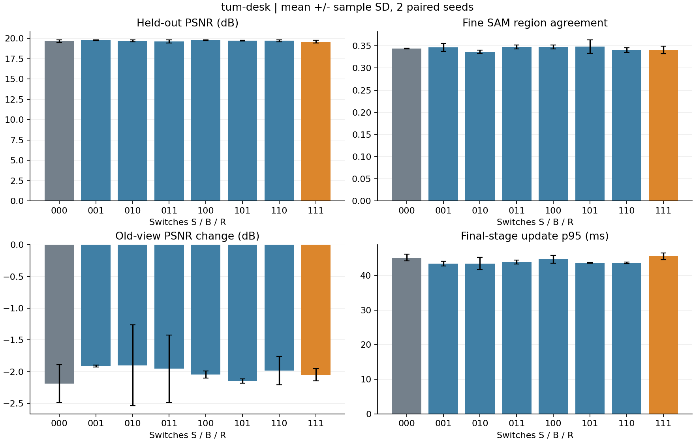
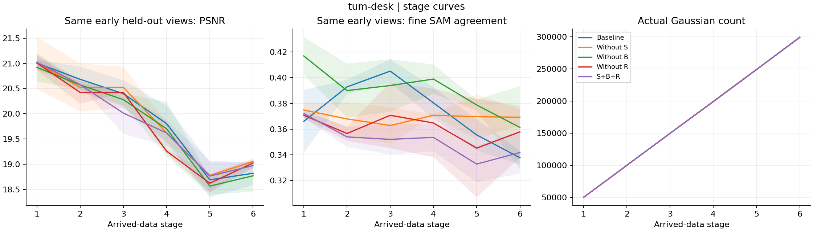
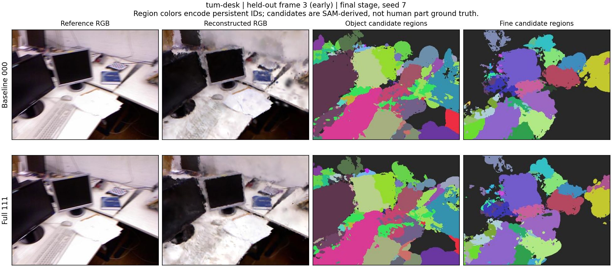
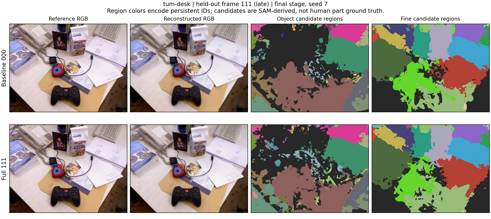
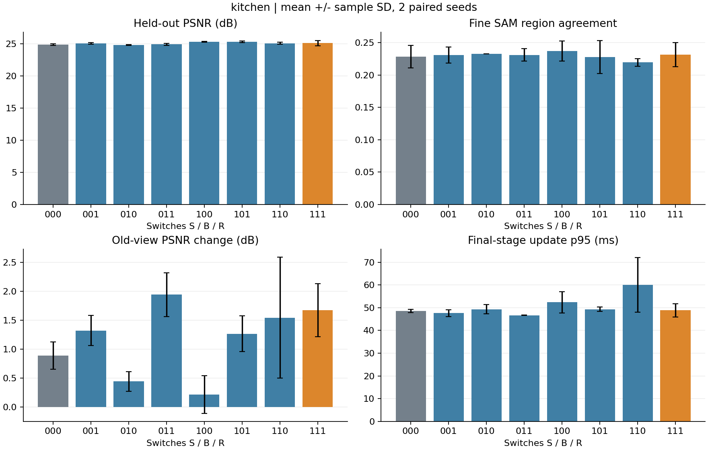
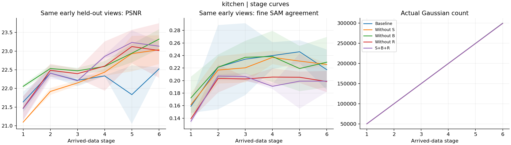
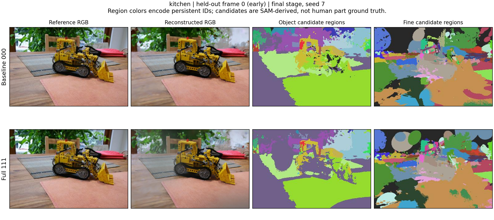
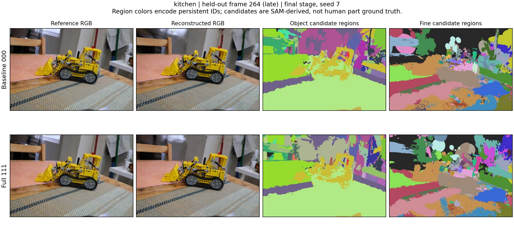

# 三项语义控制机制：真实数据消融结果

32 次独立 CUDA 训练：2 个真实场景 × 8 种 S/B/R 开关组合 × 2 个配对随机种子。下面均为均值 ± 样本标准差；只有 2 个种子，不作显著性或 SOTA 声明。用户允许减少种子后，在查看汇总前保留前两个完整种子；原协议及修订记录随结果保存。

S：语义新颖性和训练 RGB 残差引导选图，并把等尺寸裁剪更多放在已知语义区域。
B：高可信物体及细区域的覆盖稀缺度，影响初始点准入、克隆/分裂排序和容量置换；保留区域代表点。
R：旧帧池按物体/细区域加权覆盖选取，同时保留均匀探索位置与位姿多样性。

这些是待验证的候选方法，当前实现不是 SAGA/LaGa 官方完整复现。

## 公平对照协议

- T4；宽度 640；SH2；6 个数据前缀，每前缀 600 步，共 3,600 步。
- 所有组合共享相同 SAM2.1 Tiny/CLIP 教师缓存与前缀图；000 也有语义输出，但三个控制器均关闭。
- 高斯硬上限逐阶段从 5 万增加到 30 万；真实点数另报。回放概率 .3、旧帧池 48、CPU 图像缓存 32。
- 同种子的每阶段裁剪/整图和回放 Bernoulli 决策相同，裁剪 384×256；审计实际优化像素总数相等。
- 所有组合均有 2% 的定期容量置换机会；仅 B 开关改变置换评分和保护规则。
- 语义教师只从已到达训练图像读入；留出的 RGB/掩码不进入优化目标。厨房的离线 SfM 初值仍可能包含这些视角的信息。高斯分裂/克隆/删除保留锚点身份。
- TUM 每第 6 帧（余数 3）留出；厨房每第 8 帧（余数 0）留出。SAM 参考视图也不进入训练。

## 主要结果

细区域分数是 Hungarian 匹配后的 **SAM 区域一致性**，包括未知和未匹配区域的零分；不是人工语义类别或部件真值 mIoU。旧 PSNR 变化是在相同第一阶段留出相机上计算末阶段减首阶段。必须同时看旧视角末阶段绝对分数和阶段曲线：较低的起点也会产生较大的正变化。

### tum-desk

| 组合 | PSNR dB | SSIM | 物体 SAM | 细区域 SAM | 小细区域 SAM | 旧视角末期 PSNR dB | 旧 PSNR 变化 dB |
|---|---:|---:|---:|---:|---:|---:|---:|
| 基线 (000) | 19.654 ± 0.164 | 0.653 ± 0.012 | 0.415 ± 0.009 | 0.344 ± 0.001 | 0.082 ± 0.006 | 18.819 ± 0.235 | -2.187 ± 0.298 |
| R (001) | 19.758 ± 0.034 | 0.657 ± 0.001 | 0.417 ± 0.005 | 0.347 ± 0.009 | 0.080 ± 0.001 | 19.087 ± 0.038 | -1.916 ± 0.016 |
| B (010) | 19.682 ± 0.107 | 0.656 ± 0.007 | 0.431 ± 0.008 | 0.337 ± 0.003 | 0.086 ± 0.009 | 19.107 ± 0.113 | -1.903 ± 0.638 |
| B+R (011) | 19.611 ± 0.179 | 0.654 ± 0.002 | 0.421 ± 0.004 | 0.348 ± 0.005 | 0.095 ± 0.004 | 19.053 ± 0.018 | -1.956 ± 0.531 |
| S (100) | 19.766 ± 0.048 | 0.652 ± 0.000 | 0.403 ± 0.002 | 0.348 ± 0.004 | 0.091 ± 0.010 | 18.864 ± 0.276 | -2.048 ± 0.057 |
| S+R (101) | 19.708 ± 0.065 | 0.653 ± 0.003 | 0.409 ± 0.006 | 0.349 ± 0.015 | 0.092 ± 0.014 | 18.770 ± 0.313 | -2.150 ± 0.035 |
| S+B (110) | 19.697 ± 0.122 | 0.652 ± 0.003 | 0.432 ± 0.010 | 0.340 ± 0.006 | 0.100 ± 0.011 | 19.023 ± 0.086 | -1.984 ± 0.224 |
| S+B+R (111) | 19.584 ± 0.158 | 0.647 ± 0.006 | 0.416 ± 0.004 | 0.341 ± 0.009 | 0.100 ± 0.018 | 18.972 ± 0.058 | -2.050 ± 0.097 |

| 组合 | 点数 | 建图总秒 | 最末阶段更新 p95 ms | PyTorch 优化循环峰值 MiB | CPU 峰值 MiB | 全流程进程秒 |
|---|---:|---:|---:|---:|---:|---:|
| 基线 | 299207.5 ± 91.2 | 72.5 ± 2.7 | 45.1 ± 1.0 | 326.4 ± 1.3 | 1807.8 ± 8.2 | 91.0 ± 3.5 |
| R | 299254.5 ± 169.0 | 71.4 ± 0.2 | 43.4 ± 0.7 | 325.0 ± 4.4 | 1805.6 ± 9.2 | 88.8 ± 0.7 |
| B | 299066.5 ± 119.5 | 70.9 ± 0.7 | 43.4 ± 1.7 | 320.6 ± 0.4 | 1844.7 ± 3.7 | 88.0 ± 1.0 |
| B+R | 299085.5 ± 46.0 | 72.2 ± 0.0 | 43.9 ± 0.5 | 325.8 ± 3.9 | 1847.0 ± 5.4 | 89.8 ± 0.9 |
| S | 299146.0 ± 17.0 | 71.9 ± 0.6 | 44.7 ± 1.1 | 324.6 ± 2.3 | 1811.3 ± 3.9 | 89.7 ± 0.4 |
| S+R | 299197.5 ± 285.0 | 72.9 ± 0.2 | 43.6 ± 0.1 | 320.5 ± 4.0 | 1808.8 ± 7.8 | 89.9 ± 0.4 |
| S+B | 298971.5 ± 81.3 | 72.5 ± 0.1 | 43.6 ± 0.2 | 327.9 ± 4.8 | 1847.5 ± 7.9 | 91.3 ± 2.0 |
| S+B+R | 298911.0 ± 93.3 | 73.3 ± 0.5 | 45.5 ± 1.0 | 328.1 ± 1.1 | 1839.9 ± 1.0 | 91.3 ± 0.6 |

**配对消融差值**（完整模型减去对应模块关闭的模型；PSNR/区域分数正值更好，耗时正值更慢）：

| 对照 | PSNR Δ dB | 细区域 SAM Δ | 旧视角末期 PSNR Δ dB | 更新 p95 Δ ms |
|---|---:|---:|---:|---:|
| 完整 − 基线 | -0.070 ± 0.006 | -0.003 ± 0.008 | 0.154 ± 0.293 | 0.391 ± 0.030 |
| S 的作用（B/R 开） | -0.027 ± 0.337 | -0.007 ± 0.004 | -0.080 ± 0.075 | 1.655 ± 0.463 |
| B 的作用（S/R 开） | -0.124 ± 0.093 | -0.008 ± 0.007 | 0.203 ± 0.256 | 1.929 ± 0.892 |
| R 的作用（S/B 开） | -0.114 ± 0.035 | 0.000 ± 0.014 | -0.051 ± 0.144 | 1.907 ± 1.230 |

实测完整模型相对基线：PSNR -0.070 dB，细区域一致性 -0.0032，旧视角末期 PSNR +0.154 dB。这些差值按实测保留，不能预设三项都有效。

### kitchen

| 组合 | PSNR dB | SSIM | 物体 SAM | 细区域 SAM | 小细区域 SAM | 旧视角末期 PSNR dB | 旧 PSNR 变化 dB |
|---|---:|---:|---:|---:|---:|---:|---:|
| 基线 (000) | 24.866 ± 0.110 | 0.799 ± 0.004 | 0.300 ± 0.005 | 0.228 ± 0.017 | 0.073 ± 0.011 | 22.525 ± 0.040 | 0.886 ± 0.235 |
| R (001) | 25.087 ± 0.121 | 0.800 ± 0.000 | 0.293 ± 0.013 | 0.231 ± 0.013 | 0.079 ± 0.012 | 23.010 ± 0.108 | 1.322 ± 0.263 |
| B (010) | 24.797 ± 0.055 | 0.792 ± 0.005 | 0.294 ± 0.009 | 0.232 ± 0.000 | 0.092 ± 0.004 | 21.689 ± 0.194 | 0.442 ± 0.171 |
| B+R (011) | 24.934 ± 0.149 | 0.798 ± 0.003 | 0.320 ± 0.001 | 0.231 ± 0.010 | 0.084 ± 0.002 | 23.039 ± 0.385 | 1.942 ± 0.379 |
| S (100) | 25.303 ± 0.053 | 0.798 ± 0.000 | 0.304 ± 0.013 | 0.237 ± 0.015 | 0.099 ± 0.007 | 22.275 ± 0.191 | 0.211 ± 0.327 |
| S+R (101) | 25.317 ± 0.139 | 0.802 ± 0.001 | 0.292 ± 0.012 | 0.228 ± 0.025 | 0.074 ± 0.023 | 23.322 ± 0.264 | 1.266 ± 0.308 |
| S+B (110) | 25.091 ± 0.172 | 0.800 ± 0.000 | 0.303 ± 0.006 | 0.219 ± 0.006 | 0.074 ± 0.012 | 23.017 ± 0.731 | 1.545 ± 1.049 |
| S+B+R (111) | 25.114 ± 0.408 | 0.798 ± 0.003 | 0.302 ± 0.002 | 0.232 ± 0.019 | 0.082 ± 0.011 | 23.133 ± 0.130 | 1.671 ± 0.459 |

| 组合 | 点数 | 建图总秒 | 最末阶段更新 p95 ms | PyTorch 优化循环峰值 MiB | CPU 峰值 MiB | 全流程进程秒 |
|---|---:|---:|---:|---:|---:|---:|
| 基线 | 299555.0 ± 14.1 | 89.1 ± 0.2 | 48.6 ± 0.7 | 322.5 ± 0.5 | 1688.5 ± 5.8 | 118.0 ± 1.3 |
| R | 299493.0 ± 50.9 | 90.3 ± 1.0 | 47.6 ± 1.4 | 323.6 ± 1.8 | 1683.9 ± 2.4 | 119.6 ± 1.8 |
| B | 299238.5 ± 30.4 | 87.7 ± 1.8 | 49.3 ± 2.0 | 321.2 ± 3.6 | 1727.5 ± 7.2 | 115.4 ± 2.1 |
| B+R | 299213.0 ± 76.4 | 89.6 ± 0.1 | 46.6 ± 0.1 | 323.5 ± 0.6 | 1719.2 ± 5.1 | 118.4 ± 0.5 |
| S | 299580.5 ± 79.9 | 92.2 ± 4.5 | 52.4 ± 4.6 | 323.2 ± 2.2 | 1687.1 ± 5.9 | 119.3 ± 3.0 |
| S+R | 299554.0 ± 4.2 | 91.2 ± 0.8 | 49.3 ± 1.0 | 322.0 ± 1.9 | 1683.1 ± 0.3 | 119.6 ± 0.5 |
| S+B | 299299.0 ± 26.9 | 90.2 ± 2.3 | 60.1 ± 12.0 | 319.7 ± 0.3 | 1722.3 ± 3.1 | 120.9 ± 0.6 |
| S+B+R | 299187.5 ± 41.7 | 93.5 ± 0.8 | 48.8 ± 2.9 | 323.1 ± 0.9 | 1724.4 ± 3.9 | 123.8 ± 0.6 |

**配对消融差值**（完整模型减去对应模块关闭的模型；PSNR/区域分数正值更好，耗时正值更慢）：

| 对照 | PSNR Δ dB | 细区域 SAM Δ | 旧视角末期 PSNR Δ dB | 更新 p95 Δ ms |
|---|---:|---:|---:|---:|
| 完整 − 基线 | 0.248 ± 0.298 | 0.003 ± 0.036 | 0.608 ± 0.170 | 0.227 ± 2.216 |
| S 的作用（B/R 开） | 0.180 ± 0.556 | 0.001 ± 0.009 | 0.093 ± 0.515 | 2.208 ± 2.805 |
| B 的作用（S/R 开） | -0.203 ± 0.269 | 0.004 ± 0.007 | -0.190 ± 0.134 | -0.447 ± 1.909 |
| R 的作用（S/B 开） | 0.023 ± 0.235 | 0.012 ± 0.013 | 0.116 ± 0.602 | -11.252 ± 9.096 |

实测完整模型相对基线：PSNR +0.248 dB，细区域一致性 +0.0034，旧视角末期 PSNR +0.608 dB。这些差值按实测保留，不能预设三项都有效。

## 语义层级与计算开销

独立教师基准：模型装载 4.41 秒；SAM+CLIP 的整卡采样峰值 2995 MiB。教师每隔 6 个训练帧执行一次；该成本没有混入建图优化步耗时。

- tum-desk：教师单帧 2.40–3.17 秒（3 帧，含首帧预热）；前缀图准备 30.40 秒；最终 169 个候选区域节点。可比较锚点的父子一致率 95.0%，这项仅检查内部包含关系，不证明部件语义正确。
- kitchen：教师单帧 2.36–4.55 秒（3 帧，含首帧预热）；前缀图准备 151.16 秒；最终 219 个候选区域节点。可比较锚点的父子一致率 92.2%，这项仅检查内部包含关系，不证明部件语义正确。

PyTorch 优化循环峰值只统计张量分配，在每阶段点准入之后重置，因此不包含初始化/追加点时的瞬时峰值。`evaluation_gpu_peak_mib` 是该阶段优化与评估的共同累计峰值。`runs.csv` 另有 1 Hz nvidia-smi 整卡采样值（可漏掉短峰，第一组监测不完整）。进程总耗时含导入、CPU 数据读取、评估与导出；建图总耗时含逐前缀初始化/准入和训练，不含评估。控制器累计计时包含选图及数据访问，不单独分解增密策略耗时；增密开销包含在优化步中。

## 审计与边界

- 32 组均检查完成标记、每阶段步数/上限、实际优化像素预算和留出相机集合。全部检查点均通过有限数值与语义身份检查。冻结的训练源码哈希保持一致。
- 另有未来 RGB/深度/位姿扰动不改变 TUM 已到达前缀锚点、留出深度不准入、相机裁剪射线等价、区域匹配计分和高斯分裂身份继承检查。
- TUM 使用已知真值相机位姿；厨房使用离线 COLMAP 位姿、三角化点与全局归一化。厨房的点释放限制不能消除离线 SfM 的未来信息。因此是已知位姿下的六批增量建图，不是严格在线 RGB SLAM。
- SAM 细区域是候选部件，CLIP 名称可能错；父子关系可能冲突，不能声称可靠命名部件树。
- 厨房训练缓存复用了上一实验 41 个训练视角的 SAM/CLIP 输出（原图宽 779），掩码缩放到本次宽 640；新生成参考视角为 640。各组使用相同缓存。精确重现本次对比应使用归档教师/前缀文件。
- 没有在线学习 SAGA 式亲和场；本版使用持久区域 ID 与有界 CLIP 多视角原型。几何 RGB/深度损失保持相同，语义通过控制器影响学习过程。
- S 的开关同时控制语义新颖性/RGB 残差选图和区域裁剪；本次模块消融不能区分这三个子因素的独立贡献。
- 区域渲染采用已知 ID 的透明度加权投票，未知高斯不投票；微弱背景投票可能延伸到未标注区域，覆盖率不能单独当作分割准确率。
- Gaussian 及图像缓存/回放池有界，但当前实现预载数据集锚点，历史节点元信息仍会增长。不能声称总 CPU 内存对无限流恒定。
- 两个场景不能代表多房间/动态环境。600 步/阶段验证有限计算预算下的表现，不是收敛质量；不与先前不同分辨率/步数的实验混作公平比较。

## 文件

`analysis/runs.csv`：32 组原始汇总；`stages.csv`：192 个阶段；`contrasts.csv`：主效应、配对去模块与二阶交互。`results/` 保留每视角分数、训练日志、采样与增密审计。
归档含全部指标、不可变教师/前缀输入，以及两个场景 seed 7 的 000/111 四个完整检查点和导出地图。其余 28 个计划内检查点暂存原 Colab 运行时，未包含在便携结果包内。数据集原图请从官方来源重新取得。

来源：[TUM RGB-D](https://cvg.cit.tum.de/data/datasets/rgbd-dataset/download)、[Mip-NeRF 360](https://jonbarron.info/mipnerf360/)、[gsplat](https://github.com/nerfstudio-project/gsplat)、[SAM 2](https://github.com/facebookresearch/sam2)、[SAGA](https://github.com/Jumpat/SegAnyGAussians)、[LaGa](https://github.com/SJTU-DeepVisionLab/LaGa)。
